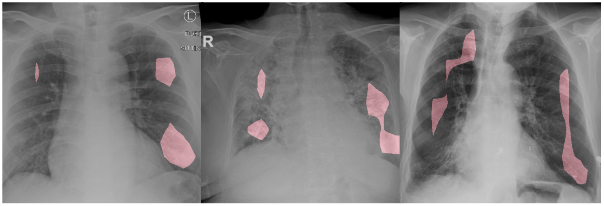
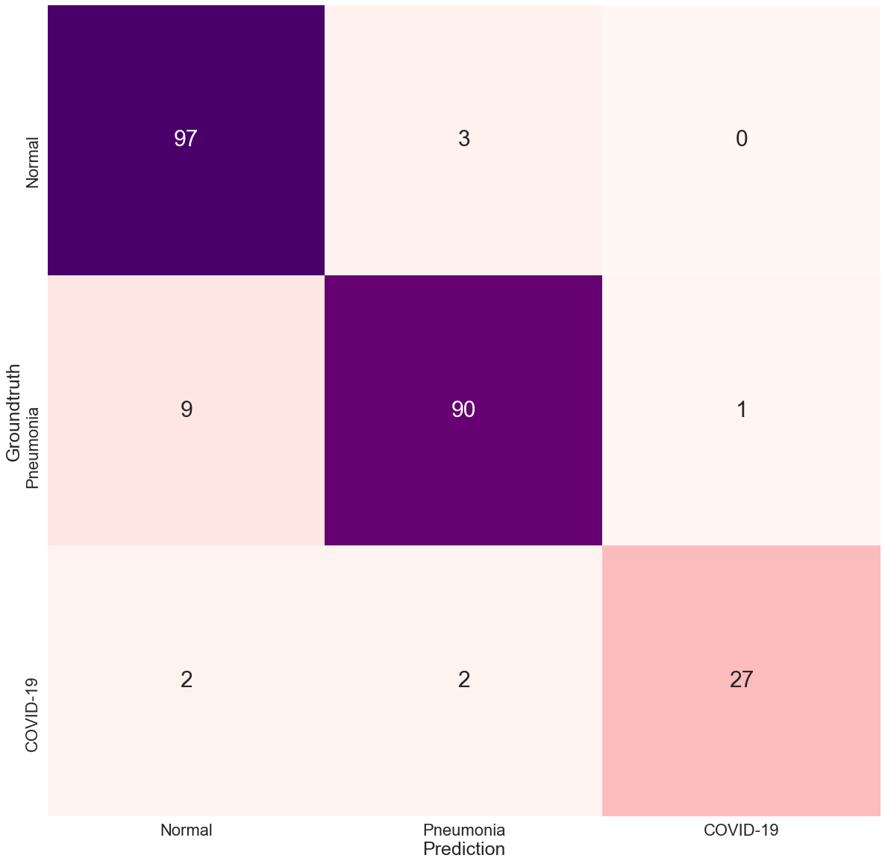

# COVID-Net Open Source Initiative

**Note: The COVID-Net models provided here are intended to be used as reference models that can be built upon and enhanced as new data becomes available. They are currently at a research stage and not yet intended as production-ready models (not meant for direct clinical diagnosis), and we are working continuously to improve them as new data becomes available. Please do not use COVID-Net for self-diagnosis and seek help from your local health authorities.**

**Recording to webinar on [How we built COVID-Net in 7 days with Gensynth](https://darwinai.news/fny)**

**Update 06/01/2020:** We released an [inference script](docs/covidnet_severity.md) and the [models](docs/models.md) for  geographic and opacity extent scoring of SARS-CoV-2 lung severity.\
**Update 05/26/2020:** For a detailed description of the methodology behind COVID-Net based deep neural networks for geographic extent and opacity extent scoring of chest X-rays for SARS-CoV-2 lung disease severity, see the paper [here](https://arxiv.org/abs/2005.12855).\
**Update 05/13/2020:** We released 3 new models, COVIDNet-CXR3-A, COVIDNet-CXR3-B, COVIDNet-CXR3-C, which were trained on a new COVIDx dataset with both PA and AP X-Rays. The results are now based on a test set containing 100 COVID-19 samples.\
**Update 04/16/2020:** If you have questions, please check the new [FAQ](docs/FAQ.md) page first.

<p align="center">
	
	<br>
	<em>Example chest radiography images of COVID-19 cases from 2 different patients and their associated critical factors (highlighted in red) as identified by GSInquire.</em>
</p>

The COVID-19 pandemic continues to have a devastating effect on the health and well-being of the global population.  A critical step in the fight against COVID-19 is effective screening of infected patients, with one of the key screening approaches being radiology examination using chest radiography.  It was found in early studies that patients present abnormalities in chest radiography images that are characteristic of those infected with COVID-19.  Motivated by this and inspired by the open source efforts of the research community, in this study we introduce COVID-Net, a deep convolutional neural network design tailored for the detection of COVID-19 cases from chest X-ray (CXR) images that is open source and available to the general public. To the best of the authors' knowledge, COVID-Net is one of the first open source network designs for COVID-19 detection from CXR images at the time of initial release.  We also introduce COVIDx, an open access benchmark dataset that we generated comprising of 13,975 CXR images across 13,870 patient patient cases, with the largest number of publicly available COVID-19 positive cases to the best of the authors' knowledge.  Furthermore, we investigate how COVID-Net makes predictions using an explainability method in an attempt to not only gain deeper insights into critical factors associated with COVID cases, which can aid clinicians in improved screening, but also audit COVID-Net in a responsible and transparent manner to validate that it is making decisions based on relevant information from the CXR images.  **By no means a production-ready solution**, the hope is that the open access COVID-Net, along with the description on constructing the open source COVIDx dataset, will be leveraged and build upon by both researchers and citizen data scientists alike to accelerate the development of highly accurate yet practical deep learning solutions for detecting COVID-19 cases and accelerate treatment of those who need it the most.

For a detailed description of the methodology behind COVID-Net and a full description of the COVIDx dataset, please click [here](https://arxiv.org/abs/2003.09871).

For a detailed description of the methodology behind COVID-Net based deep neural networks for geographic extent and opacity extent scoring of chest X-rays for SARS-CoV-2 lung disease severity, please click [here](https://arxiv.org/abs/2005.12855).

Currently, the COVID-Net team is working on **COVID-RiskNet**, a deep neural network tailored for COVID-19 risk stratification.  Currently this is available as a work-in-progress via included `train_risknet.py` script, help to contribute data and we can improve this tool.

If you would like to **contribute COVID-19 x-ray images**, please submit to https://figure1.typeform.com/to/lLrHwv. Lets all work together to stop the spread of COVID-19!

If you are a researcher or healthcare worker and you would like access to the **GSInquire tool to use to interpret COVID-Net results** on your data or existing data, please reach out to a28wong@uwaterloo.ca or alex@darwinai.ca

Our desire is to encourage broad adoption and contribution to this project. Accordingly this project has been licensed under the GNU Affero General Public License 3.0. Please see [license file](LICENSE.md) for terms. If you would like to discuss alternative licensing models, please reach out to us at linda.wang513@gmail.com and a28wong@uwaterloo.ca or alex@darwinai.ca

If there are any technical questions after the README, FAQ, and past/current issues have been read, please post an issue or contact:
* desmond.zq.lin@gmail.com
* paul@darwinai.ca
* jamesrenhoulee@gmail.com
* linda.wang513@gmail.com
* ashkan.ebadi@nrc-cnrc.gc.ca

If you find our work useful, can cite our paper using:

```
@misc{wang2020covidnet,
    title={COVID-Net: A Tailored Deep Convolutional Neural Network Design for Detection of COVID-19 Cases from Chest Radiography Images},
    author={Linda Wang, Zhong Qiu Lin and Alexander Wong},
    year={2020},
    eprint={2003.09871},
    archivePrefix={arXiv},
    primaryClass={cs.CV}
}
```

## Core COVID-Net Team
* DarwinAI Corp., Canada and Vision and Image Processing Research Group, University of Waterloo, Canada
	* Linda Wang
	* Alexander Wong
	* Zhong Qiu Lin
	* Paul McInnis
	* Audrey Chung
	* Hayden Gunraj, COVIDNet for CT: Coming soon.
* Vision and Image Processing Research Group, University of Waterloo, Canada
	* James Lee
* Matt Ross and Blake VanBerlo (City of London), COVID-19 Chest X-Ray Model: https://github.com/aildnont/covid-cxr
* Ashkan Ebadi (National Research Council Canada)
* Kim-Ann Git (Selayang Hospital)
* Abdul Al-Haimi, COVID-19 ShuffleNet Chest X-Ray Model: https://github.com/aalhaimi/covid-net-cxr-shuffle

## Table of Contents
1. [Requirements](#requirements) to install on your system
2. How to [generate COVIDx dataset](docs/COVIDx.md)
3. Steps for [training, evaluation and inference](docs/train_eval_inference.md) of COVIDNet
4. Steps for [inference](docs/covidnet_severity.md) of COVIDNet lung severity scoring
5. [Results](#results)
6. [Links to pretrained models](docs/models.md)

## Requirements

The main requirements are listed below:

* Tested with Tensorflow 1.13 and 1.15
* OpenCV 4.2.0
* Python 3.6
* Numpy
* Scikit-Learn
* Matplotlib

Additional requirements to generate dataset:

* PyDicom
* Pandas
* Jupyter

## Results
These are the final results for the COVIDNet models.

### COVIDNet-CXR3-A on COVIDx3 (100 COVID-19 test)
<div class="tg-wrap"><table class="tg">
  <tr>
    <th class="tg-7btt" colspan="3">Sensitivity (%)</th>
  </tr>
  <tr>
    <td class="tg-7btt">Normal</td>
    <td class="tg-7btt">Pneumonia</td>
    <td class="tg-7btt">COVID-19</td>
  </tr>
  <tr>
    <td class="tg-c3ow">93.0</td>
    <td class="tg-c3ow">93.0</td>
    <td class="tg-c3ow">94.0</td>
  </tr>
</table></div>

<div class="tg-wrap"><table class="tg">
  <tr>
    <th class="tg-7btt" colspan="3">Positive Predictive Value (%)</th>
  </tr>
  <tr>
    <td class="tg-7btt">Normal</td>
    <td class="tg-7btt">Pneumonia</td>
    <td class="tg-7btt">COVID-19</td>
  </tr>
  <tr>
    <td class="tg-c3ow">92.1</td>
    <td class="tg-c3ow">90.3</td>
    <td class="tg-c3ow">97.9</td>
  </tr>
</table></div>

### COVIDNet-CXR3-B on COVIDx3 (100 COVID-19 test)
<div class="tg-wrap"><table class="tg">
  <tr>
    <th class="tg-7btt" colspan="3">Sensitivity (%)</th>
  </tr>
  <tr>
    <td class="tg-7btt">Normal</td>
    <td class="tg-7btt">Pneumonia</td>
    <td class="tg-7btt">COVID-19</td>
  </tr>
  <tr>
    <td class="tg-c3ow">95.0</td>
    <td class="tg-c3ow">94.0</td>
    <td class="tg-c3ow">91.0</td>
  </tr>
</table></div>

<div class="tg-wrap"><table class="tg">
  <tr>
    <th class="tg-7btt" colspan="3">Positive Predictive Value (%)</th>
  </tr>
  <tr>
    <td class="tg-7btt">Normal</td>
    <td class="tg-7btt">Pneumonia</td>
    <td class="tg-7btt">COVID-19</td>
  </tr>
  <tr>
    <td class="tg-c3ow">90.5</td>
    <td class="tg-c3ow">91.3</td>
    <td class="tg-c3ow">98.9</td>
  </tr>
</table></div>

### COVIDNet-CXR3-C on COVIDx3 (100 COVID-19 test)
<div class="tg-wrap"><table class="tg">
  <tr>
    <th class="tg-7btt" colspan="3">Sensitivity (%)</th>
  </tr>
  <tr>
    <td class="tg-7btt">Normal</td>
    <td class="tg-7btt">Pneumonia</td>
    <td class="tg-7btt">COVID-19</td>
  </tr>
  <tr>
    <td class="tg-c3ow">92.0</td>
    <td class="tg-c3ow">90.0</td>
    <td class="tg-c3ow">95.0</td>
  </tr>
</table></div>

<div class="tg-wrap"><table class="tg">
  <tr>
    <th class="tg-7btt" colspan="3">Positive Predictive Value (%)</th>
  </tr>
  <tr>
    <td class="tg-7btt">Normal</td>
    <td class="tg-7btt">Pneumonia</td>
    <td class="tg-7btt">COVID-19</td>
  </tr>
  <tr>
    <td class="tg-c3ow">90.2</td>
    <td class="tg-c3ow">91.8</td>
    <td class="tg-c3ow">95.0</td>
  </tr>
</table></div>

### COVIDNet-CXR Small on COVIDx2 (31 COVID-19 test)
<!--<p>
	
	<br>
	<em>Confusion matrix for COVIDNet-CXR Small on the COVIDx test dataset.</em>
</p>-->

<div class="tg-wrap"><table class="tg">
  <tr>
    <th class="tg-7btt" colspan="3">Sensitivity (%)</th>
  </tr>
  <tr>
    <td class="tg-7btt">Normal</td>
    <td class="tg-7btt">Pneumonia</td>
    <td class="tg-7btt">COVID-19</td>
  </tr>
  <tr>
    <td class="tg-c3ow">97.0</td>
    <td class="tg-c3ow">90.0</td>
    <td class="tg-c3ow">87.1</td>
  </tr>
</table></div>

<div class="tg-wrap"><table class="tg">
  <tr>
    <th class="tg-7btt" colspan="3">Positive Predictive Value (%)</th>
  </tr>
  <tr>
    <td class="tg-7btt">Normal</td>
    <td class="tg-7btt">Pneumonia</td>
    <td class="tg-7btt">COVID-19</td>
  </tr>
  <tr>
    <td class="tg-c3ow">89.8</td>
    <td class="tg-c3ow">94.7</td>
    <td class="tg-c3ow">96.4</td>
  </tr>
</table></div>


### COVIDNet-CXR Large on COVIDx2 (31 COVID-19 test)
<!--<p>
	
	<br>
	<em>Confusion matrix for COVIDNet-CXR Large on the COVIDx test dataset.</em>
</p>-->

<div class="tg-wrap"><table class="tg">
  <tr>
    <th class="tg-7btt" colspan="3">Sensitivity (%)</th>
  </tr>
  <tr>
    <td class="tg-7btt">Normal</td>
    <td class="tg-7btt">Pneumonia</td>
    <td class="tg-7btt">COVID-19</td>
  </tr>
  <tr>
    <td class="tg-c3ow">99.0</td>
    <td class="tg-c3ow">89.0</td>
    <td class="tg-c3ow">96.8</td>
  </tr>
</table></div>

<div class="tg-wrap"><table class="tg">
  <tr>
    <th class="tg-7btt" colspan="3">Positive Predictive Value (%)</th>
  </tr>
  <tr>
    <td class="tg-7btt">Normal</td>
    <td class="tg-7btt">Pneumonia</td>
    <td class="tg-7btt">COVID-19</td>
  </tr>
  <tr>
    <td class="tg-c3ow">91.7</td>
    <td class="tg-c3ow">98.9</td>
    <td class="tg-c3ow">90.9</td>
  </tr>
</table></div>
