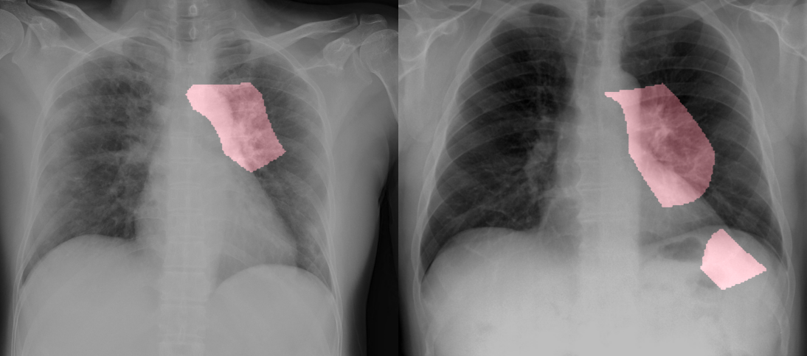
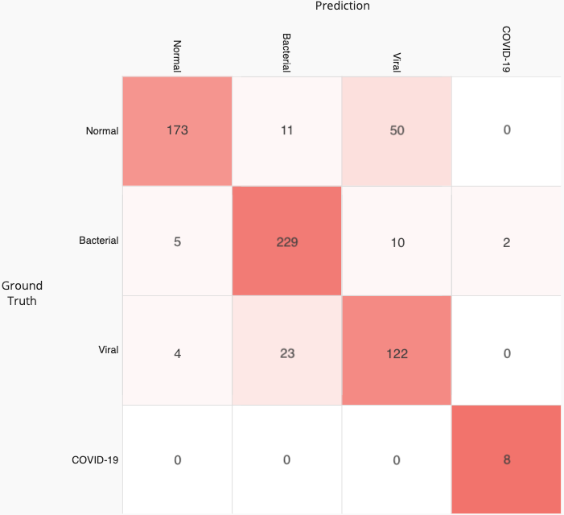

# COVID-Net and COVIDx Dataset
<p align="center">
	
	<br>
	<em>Example chest radiography images of COVID-19 cases from 2 different patients and their associated critical factors (highlighted in red) as identified by GSInquire.</em>
</p>

[Linda Wang and Alexander Wong, "COVID-Net: A Tailored Deep Convolutional Neural Network Design for Detection of COVID-19 Cases from Chest Radiography Images", 2020.](https://arxiv.org/abs/2003.09871)

The COVID-19 pandemic continues to have a devastating effect on the health and well-being of global population. A critical step in the fight against COVID-19 is effective screening of infected patients, with one of the key screening approaches being radiological imaging using chest radiography. It was found in early studies that patients present abnormalities in chest radiography images that are characteristic of those infected with COVID-19.  Motivated by this, a number of artificial intelligence (AI) systems based on deep learning have been proposed and results have been shown to be quite promising in terms of accuracy in detecting patients infected with COVID-19 using chest radiography images. However, to the best of the authors' knowledge, these developed AI systems have been closed source and unavailable to the research community for deeper understanding and extension, and unavailable for public access and use. Therefore, in this study we introduce COVID-Net, a deep convolutional neural network design tailored for the detection of COVID-19 cases from chest radiography images that is open source and available to the general public. We also describe the chest radiography dataset leveraged to train COVID-Net, which we will refer to as COVIDx and is comprised of 5941 posteroanterior chest radiography images across 2839 patient cases from two open access data repositories. Furthermore, we investigate how COVID-Net makes predictions using an explainability method in an attempt to gain deeper insights into critical factors associated with COVID cases, which can aid clinicians in improved screening. By no means a production-ready solution, the hope is that the open access COVID-Net, along with the description on constructing the open source COVIDx dataset, will be leveraged and build upon by both researchers and citizen data scientists alike to accelerate the development of highly accuracy yet practical deep learning solutions for detecting COVID-19 cases and accelerate treatment of those who need it the most.

If you would like to contribute COVID-19 x-ray images, please contact us at linda.wang513@gmail.com and a28wong@uwaterloo.ca or alex@darwinai.ca. Lets all work together to stop the spread of COVID-19!

If you are a researcher or healthcare worker and you would like access to the GSInquire tool to use to interpret COVID-Net results on your data or existing data, please reach out to a28wong@uwaterloo.ca or alex@darwinai.ca

Our desire is to encourage broad adoption and contribution to this project. Accordingly this project has been licensed under the GNU Affero General Public License 3.0. Please see [license file](LICENSE.md) for terms. If you would like to discuss alternative licensing models, please reach out to us at: linda.wang513@gmail.com and a28wong@uwaterloo.ca or alex@darwinai.ca.

If you find our work useful, can cite our paper using:

```
@misc{wang2020covidnet,
    title={COVID-Net: A Tailored Deep Convolutional Neural Network Design for Detection of COVID-19 Cases from Chest Radiography Images},
    author={Linda Wang and Alexander Wong},
    year={2020},
    eprint={2003.09871},
    archivePrefix={arXiv},
    primaryClass={cs.CV}
}
```

## Requirements
* Tested with Tensorflow 1.13 and 1.15
* Keras 2.3.1
* OpenCV 4.2.0
* Python 3.6
* OpenCV

## COVIDx Dataset
**Update: We are currently constructing an new COVIDx dataset in light of the Kaggle dataset being composed of pediatric patient cases.  Please stay tuned for the new COVIDx dataset and accompanying COVID-Net model.**

Currently, the COVIDx dataset is constructed by the following open source chest radiography datasets:
* https://github.com/ieee8023/covid-chestxray-dataset
* https://www.kaggle.com/paultimothymooney/chest-xray-pneumonia

We provide jupyter notebooks for [creating the COVIDx dataset](create_COVIDx.ipynb) and the [preprocessing](preprocessing.ipynb) used for training.
This project is still a work in progress and will continuously update these files.

The COVIDx dataset can be downloaded [here](https://drive.google.com/file/d/1-T26bHP7MCwB8vWeKufjGmPKl8pesM1J/view?usp=sharing).
Preprocessed ready-for-training COVIDx dataset can be downloaded [here](https://drive.google.com/file/d/1zCnmcMxSRZTqJywur7jCqZk0z__Mevxp/view?usp=sharing). Note: for most up-to-date data for train/test,
generate using the [preprocessing script](preprocessing.ipynb).

Chest radiography images distribution
|  Type | Normal | Bacterial| Non-COVID19 Viral | COVID-19 Viral | Total |
|:-----:|:------:|:--------:|:-----------------:|:--------------:|:-----:|
| train |  1349  |   2540   |       1355        |        66      |  5310 |
|  test |   234  |    246   |        149        |        10      |   639 |

Patients distribution
|  Type | Normal | Bacterial | Non-COVID19 Viral| COVID-19 Viral | Total |
|:-----:|:------:|:---------:|:----------------:|:--------------:|:-----:|
| train |  1001  |     853   |        534       |       47       | 2435  |
|  test |   202  |      78   |        126       |        5       |  411  |

## Training and Evaluation
Releasing soon but can download COVID-Net and start training/inferencing [here](https://drive.google.com/file/d/1FyfcAkRf-0gQ1nOrDJ9ccGVSZAO9VFP1/view?usp=sharing).

Input tensor (N, 224, 224, 3): `input_1:0`

Output tensor (N, 4): `dense_3/Softmax:0`

## Results
The results do not reflect the new COVIDx dataset.
The results are still from the previous COVIDx dataset with 8 COVID test samples.
Will update when new results become available.  

<p align="center">
	
	<br>
	<em>Confusion matrix for COVID-Net on the COVIDx test dataset.</em>
</p>

<div class="tg-wrap" align="center"><table class="tg">
  <tr>
    <th class="tg-7btt" colspan="4">Sensitivity (%)</th>
  </tr>
  <tr>
    <td class="tg-7btt">Normal</td>
    <td class="tg-7btt">Bacterial</td>
    <td class="tg-7btt">Non-COVID19 Viral</td>
    <td class="tg-7btt">COVID-19 Viral</td>
  </tr>
  <tr>
    <td class="tg-c3ow">73.9</td>
    <td class="tg-c3ow">93.1</td>
    <td class="tg-c3ow">81.9</td>
    <td class="tg-c3ow">100.0</td>
  </tr>
</table></div>

<div class="tg-wrap"><table class="tg">
  <tr>
    <th class="tg-7btt" colspan="4">Positive Predictive Value (%)</th>
  </tr>
  <tr>
    <td class="tg-7btt">Normal</td>
    <td class="tg-7btt">Bacterial</td>
    <td class="tg-7btt">Non-COVID19 Viral</td>
    <td class="tg-7btt">COVID-19 Viral</td>
  </tr>
  <tr>
    <td class="tg-c3ow">95.1</td>
    <td class="tg-c3ow">87.1</td>
    <td class="tg-c3ow">67.0</td>
    <td class="tg-c3ow">80.0</td>
  </tr>
</table></div>

## Pretrained Models
Can download COVID-Net tensorflow model from [here](https://drive.google.com/file/d/1FyfcAkRf-0gQ1nOrDJ9ccGVSZAO9VFP1/view?usp=sharing)
