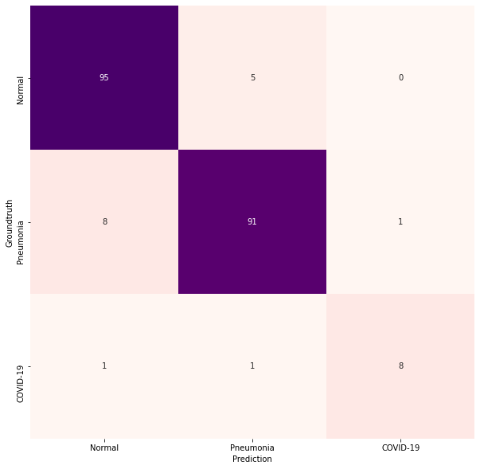

# COVID-Net Open Source Initiative

**Note: The COVID-Net models provided here are intended to be used as reference models that can be built upon and enhanced as new data becomes available. They are currently at a research stage and not yet intended as production-ready models (not meant for direct clinicial diagnosis), and we are working continuously to improve them as new data becomes available. Please do not use COVID-Net for self-diagnosis and seek help from your local health authorities.**

<p align="center">
	
	<br>
	<em>Example chest radiography images of COVID-19 cases from 2 different patients and their associated critical factors (highlighted in red) as identified by GSInquire.</em>
</p>

**Core COVID-Net team: Linda Wang, Alexander Wong, Zhong Qiu Lin, James Lee, Paul McInnis, Audrey Chung, Matt Ross (City of London), Blake VanBerlo (City of London)**\
Vision and Image Processing Research Group, University of Waterloo, Canada\
DarwinAI Corp., Canada

The COVID-19 pandemic continues to have a devastating effect on the health and well-being of the global population.  A critical step in the fight against COVID-19 is effective screening of infected patients, with one of the key screening approaches being radiological imaging using chest radiography.  It was found in early studies that patients present abnormalities in chest radiography images that are characteristic of those infected with COVID-19.  Motivated by this, a number of artificial intelligence (AI) systems based on deep learning have been proposed and results have been shown to be quite promising in terms of accuracy in detecting patients infected with COVID-19 using chest radiography images.  However, to the best of the authors' knowledge, these developed AI systems have been closed source and unavailable to the research community for deeper understanding and extension, and unavailable for public access and use.  Therefore, in this study we introduce COVID-Net, a deep convolutional neural network design tailored for the detection of COVID-19 cases from chest radiography images that is open source and available to the general public.  We also describe the chest radiography dataset leveraged to train COVID-Net, which we will refer to as COVIDx and is comprised of 16,756 chest radiography images across 13,645 patient cases from two open access data repositories.  Furthermore, we investigate how COVID-Net makes predictions using an explainability method in an attempt to gain deeper insights into critical factors associated with COVID cases, which can aid clinicians in improved screening. **By no means a production-ready solution**, the hope is that the open access COVID-Net, along with the description on constructing the open source COVIDx dataset, will be leveraged and build upon by both researchers and citizen data scientists alike to accelerate the development of highly accurate yet practical deep learning solutions for detecting COVID-19 cases and accelerate treatment of those who need it the most.

For a detailed description of the methodology behind COVID-Net and a full description of the COVIDx dataset, please click [here](https://arxiv.org/pdf/2003.09871.pdf).

Currently, the COVID-Net team is working on COVID-RiskNet, a deep neural network tailored for COVID-19 risk stratification.  Stay tuned as we make it available soon.

If you would like to **contribute COVID-19 x-ray images**, please submit to https://figure1.typeform.com/to/lLrHwv. Lets all work together to stop the spread of COVID-19!

If you are a researcher or healthcare worker and you would like access to the **GSInquire tool to use to interpret COVID-Net results** on your data or existing data, please reach out to a28wong@uwaterloo.ca or alex@darwinai.ca

Our desire is to encourage broad adoption and contribution to this project. Accordingly this project has been licensed under the GNU Affero General Public License 3.0. Please see [license file](LICENSE.md) for terms. If you would like to discuss alternative licensing models, please reach out to us at linda.wang513@gmail.com and a28wong@uwaterloo.ca or alex@darwinai.ca

The README contains information about:
* [requirements](#requirements) to install on your system
* how to [generate COVIDx dataset](#covidx-dataset)
* steps for [training](#steps-for-training), [evaluation](#steps-for-evaluation) and [inference](#steps-for-inference)
* [results](#results)
* [links to pretrained models](#pretrained-models)

If there are any technical questions after the README and past/current issues have been read, please post an issue or contact:
* desmond.zq.lin@gmail.com
* paul@darwinai.ca
* jamesrenhoulee@gmail.com
* linda.wang513@gmail.com

If you find our work useful, can cite our paper using:

```
@misc{wang2020covidnet,
    title={COVID-Net: A Tailored Deep Convolutional Neural Network Design for Detection of COVID-19 Cases from Chest Radiography Images},
    author={Linda Wang and Alexander Wong},
    year={2020},
    eprint={2003.09871},
    archivePrefix={arXiv},
    primaryClass={cs.CV}
}
```

## Requirements

The main requirements are listed below:

* Tested with Tensorflow 1.13 and 1.15
* OpenCV 4.2.0
* Python 3.6
* Numpy
* OpenCV
* Scikit-Learn
* Matplotlib

Additional requirements to generate dataset:

* PyDicom
* Pandas
* Jupyter

## COVIDx Dataset

**Update: we have released the brand-new COVIDx dataset with 16,756 chest radiography images across 13,645 patient cases.**

The current COVIDx dataset is constructed by the following open source chest radiography datasets:
* https://github.com/ieee8023/covid-chestxray-dataset
* https://www.kaggle.com/c/rsna-pneumonia-detection-challenge (which came from: https://nihcc.app.box.com/v/ChestXray-NIHCC)

We especially thank the Radiological Society of North America and others involved in the RSNA Pneumonia Detection Challenge, and Dr. Joseph Paul Cohen and the team at MILA involved in the COVID-19 image data collection project, for making data available to the global community.

### Steps to generate the dataset

1. Download the datasets listed above
 * `git clone https://github.com/ieee8023/covid-chestxray-dataset.git`
 * go to this [link](https://www.kaggle.com/c/rsna-pneumonia-detection-challenge/data) to download the RSNA pneumonia dataset
2. Create a `data` directory and within the data directory, create a `train` and `test` directory
3. Use [create\_COVIDx\_v2.ipynb](create_COVIDx_v2.ipynb) to combine the two dataset to create COVIDx. Make sure to remember to change the file paths.
4. We provide the train and test txt files with patientId, image path and label (normal, pneumonia or COVID-19). The description for each file is explained below:
 * [train\_COVIDx.txt](train_COVIDx.txt): This file contains the samples used for training.
 * [test\_COVIDx.txt](test_COVIDx.txt): This file contains the samples used for testing.

### COVIDx data distribution

Chest radiography images distribution
|  Type | Normal | Pneumonia | COVID-19 | Total |
|:-----:|:------:|:---------:|:--------:|:-----:|
| train |  7966  |    8514   |    66    | 16546 |
|  test |   100  |     100   |    10    |   210 |

Patients distribution
|  Type | Normal | Pneumonia | COVID-19 |  Total |
|:-----:|:------:|:---------:|:--------:|:------:|
| train |  7966  |    5429   |    48    |  13443 |
|  test |   100  |      98   |     5    |    203 |

## Training and Evaluation
The network takes as input an image of shape (N, 224, 224, 3) and outputs the softmax probabilities as (N, 3), where N is the number of batches.
If using the TF checkpoints, here are some useful tensors:

* input tensor: `input_1:0`
* logit tensor: `dense_3/MatMul:0`
* output tensor: `dense_3/Softmax:0`
* label tensor: `dense_3_target:0`
* class weights tensor: `dense_3_sample_weights:0`
* loss tensor: `loss/mul:0`

### Steps for training
TF training script from a pretrained model:
1. We provide you with the tensorflow evaluation script, [train_tf.py](train_tf.py)
2. Locate the tensorflow checkpoint files (location of pretrained model)
3. To train from a pretrained model, `python train_tf.py --weightspath models/COVIDNetv2 --metaname model.meta_train --ckptname model-2069`
4. For more options and information, `python train_tf.py --help`

### Steps for evaluation

1. We provide you with the tensorflow evaluation script, [eval.py](eval.py)
2. Locate the tensorflow checkpoint files
3. To evaluate a tf checkpoint, `python eval.py --weightspath models/COVID-Netv2 --metaname model.meta_eval --ckptname model-2069`
4. For more options and information, `python eval.py --help`

### Steps for inference
**DISCLAIMER: Do not use this prediction for self-diagnosis. You should check with your local authorities for the latest advice on seeking medical assistance.**

1. Download a model from the [pretrained models section](#pretrained-models)
2. Locate models and xray image to be inferenced
3. To inference, `python inference.py --weightspath models/COVID-Netv2 --metaname model.meta_eval --ckptname model-2069 --imagepath assets/ex-covid.jpeg`
4. For more options and information, `python inference.py --help`

## Results
These are the final results for COVID-Net Small and COVID-Net Large.   

### COVIDNet Small
<p align="center">
	
	<br>
	<em>Confusion matrix for COVID-Net on the COVIDx test dataset.</em>
</p>

<div class="tg-wrap" align="center"><table class="tg">
  <tr>
    <th class="tg-7btt" colspan="3">Sensitivity (%)</th>
  </tr>
  <tr>
    <td class="tg-7btt">Normal</td>
    <td class="tg-7btt">Pneumonia</td>
    <td class="tg-7btt">COVID-19</td>
  </tr>
  <tr>
    <td class="tg-c3ow">95.0</td>
    <td class="tg-c3ow">91.0</td>
    <td class="tg-c3ow">80.0</td>
  </tr>
</table></div>

<div class="tg-wrap"><table class="tg">
  <tr>
    <th class="tg-7btt" colspan="3">Positive Predictive Value (%)</th>
  </tr>
  <tr>
    <td class="tg-7btt">Normal</td>
    <td class="tg-7btt">Pneumonia</td>
    <td class="tg-7btt">COVID-19</td>
  </tr>
  <tr>
    <td class="tg-c3ow">91.3</td>
    <td class="tg-c3ow">93.8</td>
    <td class="tg-c3ow">88.9</td>
  </tr>
</table></div>

### COVID-Net Large
<p align="center">
	
	<br>
	<em>Confusion matrix for COVID-Net on the COVIDx test dataset.</em>
</p>

<div class="tg-wrap" align="center"><table class="tg">
  <tr>
    <th class="tg-7btt" colspan="3">Sensitivity (%)</th>
  </tr>
  <tr>
    <td class="tg-7btt">Normal</td>
    <td class="tg-7btt">Pneumonia</td>
    <td class="tg-7btt">COVID-19</td>
  </tr>
  <tr>
    <td class="tg-c3ow">94.0</td>
    <td class="tg-c3ow">90.0</td>
    <td class="tg-c3ow">90.0</td>
  </tr>
</table></div>

<div class="tg-wrap" align="center"><table class="tg">
  <tr>
    <th class="tg-7btt" colspan="3">Positive Predictive Value (%)</th>
  </tr>
  <tr>
    <td class="tg-7btt">Normal</td>
    <td class="tg-7btt">Pneumonia</td>
    <td class="tg-7btt">COVID-19</td>
  </tr>
  <tr>
    <td class="tg-c3ow">90.4</td>
    <td class="tg-c3ow">93.8</td>
    <td class="tg-c3ow">90.0</td>
  </tr>
</table></div>

## Pretrained Models

|  Type | COVID-19 Sensitivity | # Params (M) | MACs (G) |        Model        |
|:-----:|:--------------------:|:------------:|:--------:|:-------------------:|
|  ckpt |         80.0         |     116.6    |   2.26   |[COVID-Net Small](https://drive.google.com/file/d/1xrxK9swFVlFI-WAYcccIgm0tt9RgawXD/view?usp=sharing)|
|  ckpt |         90.0         |     126.6    |   3.59   |[COVID-Net Large](https://drive.google.com/file/d/1djqWcxzRehtyJV9EQsppj1YdgsP2JRQy/view?usp=sharing)|
