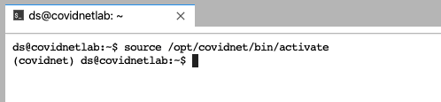
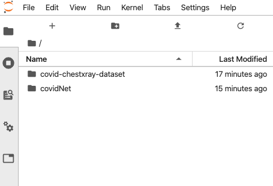

## Quick Jupyter Lab environment for COVID-Net

This docker aims to be a quick bootstrap to have a ready to use COVID-NET kernel in a dockerized jupyter

<p align="center">
  
</p>

### CovidNet Jupyter Kernel requirements
CovidNet Kernel is created and all the packages on the [covidnet-requirements.txt](opt/covidnet-requirements.txt) are installed

### Requirements:
* docker
* docker-compose

### Build & Run
Image is based on amd64/python:3.6-slim-buster from the [Python Offcial images in dockerHub](https://hub.docker.com/r/amd64/python/)

Go to the root directory of the COVID-Net repository and run the next:
```console
docker-compose build
docker-compose up
```
Please notice first time it can take some time to build the image

Visit [http://localhost:8888](http://localhost:8888)

### Notes

### Activate covidnet virutalenv on the jupyter terminal
Covidnet virtualenv is installed on /opt/covidnet, containing all the packages specified on the [covidnet-requirements.txt](opt/covidnet-requirements.txt)
```console
source /opt/covidnet/bin/activate
```
<p align="center">
  
</p>

#### Access control
Feel free if you need to add authentication modifying the entrypoint [start-notebook.sh](start-notebook.sh)

#### Persistency on the dockerized Jupyter Lab Environment
Please notice that only the volumes specified on the [docker-compose file](../docker-compose.yml) will be persistent

<p align="center">
  
</p>
